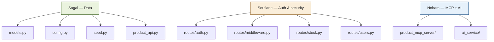
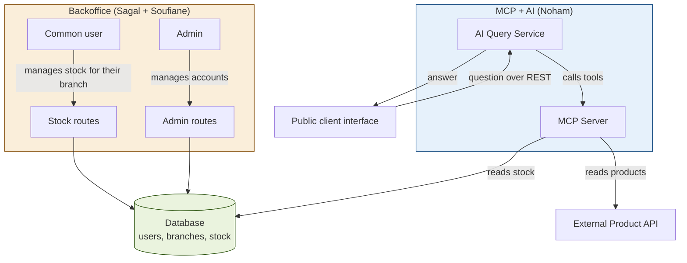
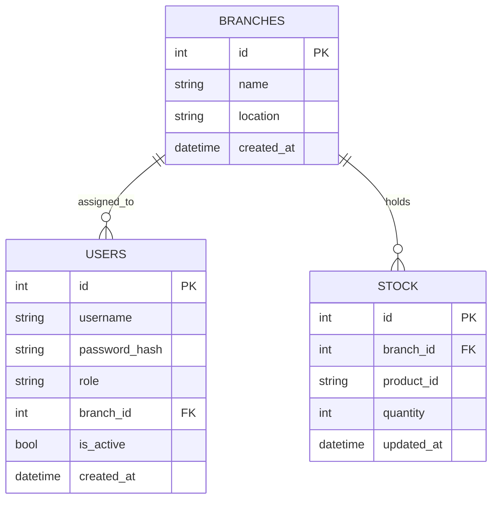

<div align="center">

# HBntory

**Multi-branch inventory management platform, with a public AI assistant**

Holberton School Project — Concepteur Développeur d'Applications


</div>

---

## Table of contents

- [Overview](#overview)
- [Team and task split](#team-and-task-split)
- [System architecture](#system-architecture)
- [Database schema](#database-schema)
- [Tech stack](#tech-stack)
- [Project structure](#project-structure)
- [Justified technical decisions](#justified-technical-decisions)
- [Installation and run](#installation-and-run)
- [Test accounts](#test-accounts)
- [Example questions for the assistant](#example-questions-for-the-assistant)
- [File-by-file explanation](#file-by-file-explanation)
- [Tests performed](#tests-performed)
- [Known limitations](#known-limitations)

---

## Overview

HBntory is a stock management system for a fictional retail company with multiple branches. The project combines two worlds that never talk to each other directly, and only ever share the same database:

- **Backoffice** — internal authenticated application, used to manage stock (employee side) and user accounts (admin side)
- **Client Web Interface** — public page, no authentication required, where anyone can ask a natural-language question about products and stock, answered by an AI agent connected to an MCP server

No product information (name, price, description) is ever stored locally: this data always comes from the external Product API provided by the school.

Full architecture, data boundaries and decision records: [`docs/architecture.md`](project-root/docs/architecture.md).

---

## Team and task split

Project built by a team of 3:

| Member | Focus area |
|---|---|
| **Sagal-Louise Haider** | Database schema and SQLAlchemy models, sessions and route protection, Product API integration, admin interface |
| **Noham Oulma** | Product MCP Server, AI Query Service, AI agent |
| **Soufiane Filali** | Password hashing, role and branch middleware, stock operations, admin user management |

### Detailed split (`backoffice/` folder)



---

## System architecture



**Key point**: the Backoffice and the AI side never communicate directly, they only share the same database. The Backoffice writes stock into it, the MCP Server reads it to answer public questions.

---

## Database schema



**Golden rule**: the `STOCK` table only stores the external product identifier (`product_id`), never its name, price, or description. That information is always fetched on demand from the Product API.

Full schema documentation, including database-level constraints and where validation lives: [`docs/database.md`](project-root/docs/database.md).

---

## Tech stack

| Component | Technology | Quick justification |
|---|---|---|
| Backoffice backend | Flask (REST API) | Lightweight, quick to set up as a team, matches the team's existing skills |
| ORM | SQLAlchemy | Required by the spec, natively protects against SQL injection |
| Database | SQLite | No server configuration needed, sufficient for the project's scope |
| Authentication | Flask-Login (sessions) | Classic internal use case, simpler to implement than JWT tokens in this context |
| Password hashing | bcrypt | Automatic salting, tunable cost factor, recognized standard for password storage |
| Public client communication | REST | Each question is handled independently, no conversation history to maintain |
| AI ↔ Product API bridge | MCP server (FastMCP) | Required by the spec, cleanly separates data access from the agent's logic |
| LLM provider | Groq | Free to use, OpenAI-compatible message and tool format, which keeps the hand-written tool loop simple |
| Backoffice interface | Vanilla HTML / CSS / JavaScript | No framework needed for the project's scope |
| Public client interface | Vanilla HTML / CSS / JavaScript | Simple chat page, no authentication |

---

## Project structure

```
HBntory-Inventor-Management-Platform/
├── AUTHORS
├── README.md
├── requirements.txt
└── project-root/
    ├── backoffice/
    │   ├── app/
    │   │   ├── __init__.py        # Flask factory, Flask-Login config, CORS
    │   │   ├── models.py           # SQLAlchemy models (Branch, User, Stock)
    │   │   ├── config.py            # Configuration (database, secret key, Product API)
    │   │   ├── seed.py               # Initial data seeding script
    │   │   └── product_api.py         # Client for the external Product API
    │   ├── routes/
    │   │   ├── auth.py               # Login, logout, bcrypt hashing
    │   │   ├── middleware.py          # Security decorators (role, branch)
    │   │   ├── stock.py                # Stock operations (common user)
    │   │   └── users.py                 # Account management (admin)
    │   ├── requirements.txt
    │   └── run.py                       # Server entry point
    ├── product_mcp_server/               # MCP server (Noham)
    │   ├── server.py                      # Entry point
    │   ├── mcp_instance.py                 # FastMCP instance
    │   ├── product_api_client.py            # Calls the external Product API
    │   ├── db.py                             # Read-only access to the shared database
    │   ├── tools/
    │   │   ├── products.py                    # list_products, get_product_details
    │   │   └── stock.py                        # check_stock, list_branch_stock, check_shopping_list
    │   ├── manual_test.py
    │   ├── requirements.txt
    │   └── README.md                            # Pointer to docs/product_mcp_server.md
    ├── ai_service/                               # AI Query Service (Noham)
    │   ├── app.py                                 # REST endpoint consumed by the client web
    │   ├── agent.py                                # Agent logic and tool-calling loop
    │   ├── tests/                                   # pytest suite (unit + live)
    │   ├── .env.example                              # Template for the Groq API key
    │   ├── pytest.ini
    │   ├── requirements.txt
    │   ├── requirements-dev.txt
    │   └── README.md                                   # Pointer to docs/ai_service.md
    ├── hbntory-products-api/                            # External Product API provided by the school
    │   ├── app.py
    │   ├── data/products.json
    │   └── docs/api_contract.md
    ├── client_web/
    │   ├── index.html                     # Public interface (dashboard, chat, products, about)
    │   ├── support.js                      # Rendering runtime
    │   ├── image-slot.js
    │   └── assets/                           # Product illustrations and team photos
    ├── admin/
    │   ├── index.html                      # Backoffice interface (login, stock, users)
    │   └── support.js                       # Rendering runtime
    └── docs/
        ├── architecture.md                   # Components, data boundaries, decision records, MVP
        ├── authentication.md                  # Authentication and authorization strategy
        ├── database.md                         # Schema, models, seeding, validation rules
        ├── ui-backend-approach.md               # REST vs SSR decision, frontend stack, CORS
        ├── test.md                               # Tests and fixed vulnerabilities, per member
        ├── product_mcp_server.md                  # Full MCP server documentation
        └── ai_service.md                           # Full AI Query Service documentation
```

---

## Justified technical decisions

Nine decision records, with benefits and trade-offs for each, are documented in
[`docs/architecture.md`](project-root/docs/architecture.md). The main ones:

### 1. Session-based authentication, not token-based

The Backoffice is a classic internal use case consumed by a single type of client (the browser). Flask-Login sessions avoid having to manually handle issuing, expiring, and verifying JWT tokens, saving meaningful time on a two-week project. Sessions also allow immediate revocation, which a JWT does not without additional infrastructure.

### 2. bcrypt for password hashing

- **How it works**: `bcrypt.hashpw()` generates a random salt on every hash and embeds it in the final result. `bcrypt.checkpw()` extracts that salt automatically to verify the supplied password.
- **Why not plain SHA256**: SHA256 is a general-purpose hash designed to be fast, which makes it vulnerable to large-scale brute-force attacks. bcrypt includes automatic salting (defeats rainbow tables) and a tunable cost factor that deliberately slows down every computation, making brute-force impractical.

### 3. Authorization enforced exclusively on the backend

Two reusable decorators (`role_required`, `branch_required`) protect every sensitive route. No permission check relies on the interface, a common user manually tampering with an HTTP request would still be blocked by the server. Account status is also re-checked on **every** request through Flask-Login's `user_loader`, so deactivating an account ends its session immediately rather than at next login.

### 4. REST rather than WebSocket for the public client

Each question sent to the chat is independent (no conversation history required by the spec), so a persistent connection brings no real benefit over the simplicity of a plain REST request.

### 5. REST API and browser rendering, rather than server-side rendering

The Backoffice exposes JSON only; rendering happens in the browser. This keeps every authorization rule on the routes instead of splitting it between routes and templates. Trade-off: an extra round-trip per view, and loading and error states handled by hand. Detailed in [`docs/ui-backend-approach.md`](project-root/docs/ui-backend-approach.md).

### 6. Two independent services sharing one database

The Backoffice and the AI Service never call each other. They share a single schema, which avoids duplicating the data model across two databases. The trade-off is discipline: the Backoffice writes, the MCP server only reads.

### 7. Stock tools built into our own MCP server

Rather than a third-party database MCP toolbox, which would give the agent flexible SQL-like access that is harder to keep read-only and scoped. A small set of hand-written, single-purpose tools keeps the boundary clear and every tool call observable.

### 8. Soft-delete rather than physical deletion

A deactivated user (`is_active = False`) can no longer log in, but their past stock movements remain intact in the database, matching the spec's requirement.

### 9. Product data resolved on demand, never stored

Product names shown in the Backoffice are fetched from the Product API at display time, in a single call per page, and never persisted. If the API is unavailable, the stock page degrades to raw SKUs and stays usable. Write operations behave the opposite way: adding stock requires validating the SKU against the catalog, so an unreachable API returns a 503 rather than inserting an unverified identifier.

### 10. No containerization

Docker was evaluated and dropped. The five services run as plain Python processes, which keeps the setup transparent and avoids build failures during a live demo. The trade-off is a longer manual startup, documented below.

---

## Installation and run

The system runs as **five separate processes**, each in its own terminal. All five must be
running for the full flow (Backoffice + AI assistant) to work.

### 1. Install dependencies

```bash
cd project-root/backoffice        && pip install -r requirements.txt
cd ../product_mcp_server          && pip install -r requirements.txt
cd ../ai_service                  && pip install -r requirements.txt
```

Add `--break-system-packages` on systems with an externally managed Python environment, or
create a virtual environment first.

### 2. Configure the AI Service

The agent needs a Groq API key. Copy the template and fill it in:

```bash
cd project-root/ai_service
cp .env.example .env
# then edit .env and set your Groq API key
```

Without this file the AI Query Service will not start, and the public client will return an
error instead of an answer. The Backoffice works independently of it.

### 3. Initialize the database

```bash
cd project-root/backoffice
python3 -m app.seed
```

`seed.py` uses relative imports and must be executed as a module, from `backoffice/` and
never from `app/`. It is idempotent: it skips seeding if the database already contains data.
To reset the data set, delete `hbntory.db` first and run it again.

### 4. Start the services

| # | Service | Command | Port |
|---|---|---|---|
| 1 | Product API | `cd project-root/hbntory-products-api && HBN_PRODUCTS_PORT=5001 python3 app.py` | 5001 |
| 2 | Backoffice | `cd project-root/backoffice && python3 run.py` | 5000 |
| 3 | MCP Server | `cd project-root/product_mcp_server && python3 server.py` | 8000 |
| 4 | AI Query Service | `cd project-root/ai_service && python3 app.py` | 8100 |
| 5 | Static frontends | `cd project-root && python3 -m http.server 5502` | 5502 |

### 5. Open the interfaces

- **Backoffice**: http://127.0.0.1:5502/admin/
- **Public client**: http://127.0.0.1:5502/client_web/

> **Port note.** The Product API defaults to port 5000, which collides with the Backoffice.
> Set `HBN_PRODUCTS_PORT=5001` so it matches `PRODUCT_API_URL` in `app/config.py`.

> **CORS note.** The frontends are served as static files on a different port from the API,
> so every request is cross-origin. The port used must appear in the allowed origins
> configured in `app/__init__.py`, otherwise login fails with an error visible only in the
> browser console.

---

## Test accounts

| Username | Password | Role | Branch |
|---|---|---|---|
| `admin` | `ChangeMe123!` | Admin | — |
| `employee1` | `ChangeMe123!` | Common user | HBntory Paris |
| `employee2` | `ChangeMe123!` | Common user | HBntory Lyon |
| `employee3` | `ChangeMe123!` | Common user | HBntory Marseille |

Seeded stock is deliberately uneven across branches: some products are held everywhere at
different quantities, some are exclusive to a single branch, and several catalog products
are stocked nowhere — so the assistant has to answer "unavailable" rather than invent a
branch.

---

## Example questions for the assistant

- *"Where can I find product X?"*
- *"What products are available in branch Y?"*
- *"I need 3 units of X, 2 of Y and 4 of Z, which branch(es) can I visit?"*
- *"Give me the details for product XX"*
- *"Tell me about product HB-ZZZ-9999"* — unknown product: the assistant states the information is unavailable rather than inventing it

The agent answers in the language the question was asked in, French or English.

---

## File-by-file explanation

### Backoffice — `app/`

| File | Role in one sentence |
|---|---|
| `models.py` | Defines the 3 tables (Branch, User, Stock) and the business rules enforced at the database level |
| `config.py` | Centralizes configuration (database path, secret key, Product API URL) |
| `seed.py` | Creates the admin, branches, and test stock on first run |
| `product_api.py` | HTTP client for the external Product API, with clean error handling (unavailability, product not found) |
| `__init__.py` | Assembles the Flask application: connects the database, configures Flask-Login and CORS, registers the routes |

### Backoffice — `routes/`

| File | Role in one sentence |
|---|---|
| `auth.py` | Login, logout, and the bcrypt hashing/verification functions |
| `middleware.py` | Two reusable security decorators: role check and branch check |
| `stock.py` | Add, remove, check, and list stock, restricted to the logged-in common user's branch |
| `users.py` | List, create, update, and deactivate accounts, restricted to the admin |

### `product_mcp_server/`

| File | Role in one sentence |
|---|---|
| `server.py` | Entry point that starts the MCP server and registers the tools |
| `mcp_instance.py` | Shared FastMCP instance |
| `product_api_client.py` | Calls the external Product API on behalf of the tools |
| `db.py` | Read-only access to the shared database, reusing the Backoffice models |
| `tools/products.py` | `list_products`, `get_product_details` |
| `tools/stock.py` | `check_stock`, `list_branch_stock`, `check_shopping_list` |

### `ai_service/`

| File | Role in one sentence |
|---|---|
| `app.py` | REST endpoint that receives a question from the client web and returns an answer |
| `agent.py` | Agent logic: system prompt, hand-written tool-calling loop, grounding rules |
| `tests/` | pytest suite covering the agent and the endpoint, unit and live |

### `client_web/`

| File | Role in one sentence |
|---|---|
| `index.html` | Public interface: dashboard, AI assistant, product catalog, about page |
| `support.js` | Rendering runtime for the page templating |
| `assets/` | Product illustrations and team photos, static files only — no product data is stored in the database |

### `admin/`

| File | Role in one sentence |
|---|---|
| `index.html` | Backoffice interface: login screen, stock management, account management |
| `support.js` | Rendering runtime for the page templating |

### Other

| File | Role in one sentence |
|---|---|
| `run.py` | Entry point that starts the Flask server |
| `AUTHORS` | Contributors to the project |

---

## Tests performed

Every test is documented per team member, along with the vulnerabilities found and the file
fixed for each, in [`docs/test.md`](project-root/docs/test.md).

| Area | Coverage | Method |
|---|---|---|
| Auth, roles, stock operations, admin management | Functional and security tests on the Backoffice | Manual, `curl` |
| Database, Product API integration, admin interface | Integration tests against the live backend and the real Product API | Manual, `curl` and browser |
| MCP tools | Tool-level tests, invalid identifiers, API outage handling | Manual script |
| AI agent and endpoint | Grounding behaviour, out-of-scope questions, tool selection | pytest, unit and live |

Three scenarios are demonstrated live during the presentation:

1. **Branch isolation** — a common user's hand-crafted request against another branch is rejected with a 403 by the route, bypassing the interface entirely.
2. **Immediate session invalidation** — an account deactivated while its session is active loses access on its next request, not at next login.
3. **Graceful degradation** — with the Product API stopped, the stock page still loads and falls back to raw SKUs.

One point of attention is carried forward to Task 6 (Client Web Interface): data displayed on the client side should be escaped using `textContent` rather than `innerHTML`, to avoid any risk of stored XSS originating from data entered through the Backoffice.

---

## Known limitations

- **Uneven automated test coverage.** The AI Service has a pytest suite; the Backoffice is verified manually through documented `curl` commands. A pytest suite covering the authorization decorators would be the first addition, since those rules are the most security-sensitive part of the codebase and the most costly to re-verify by hand.
- **No containerization.** Docker was dropped in favour of a documented manual startup, so reproducing the environment relies on following the instructions above rather than on a single command.
- **XSS escaping on the client side** is an open action item on the Client Web Interface, as noted above.
- **`GET /branches` is admin-only.** Common users would need it to display their own branch name; the admin interface currently works around this with a hardcoded list.
- **The MCP server is coupled to the Backoffice schema.** It imports the SQLAlchemy models directly, so a model change on the Backoffice side can break the stock tools.
- **`db.create_all()` does not migrate.** It creates missing tables but never alters existing ones, so a database created before a constraint was added will not gain it. During development the fix is to delete the file and re-seed; Alembic would be the production answer.
- **SQLite serializes writes.** Sufficient for the project's scope. `SQLALCHEMY_DATABASE_URI` is environment-overridable, so moving to PostgreSQL requires no code change.
- **No SSL/TLS**, explicitly out of scope per the project brief.

---

## Authors

- **Soufiane Filali** — [github.com/Souf-F](https://github.com/Souf-F)
- **Sagal-Louise Haider** — [github.com/sagalou](https://github.com/sagalou)
- **Noham Oulma** — [github.com/nohamoulma-hub](https://github.com/nohamoulma-hub)