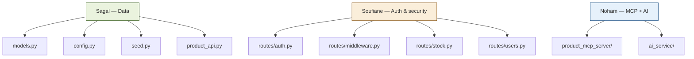
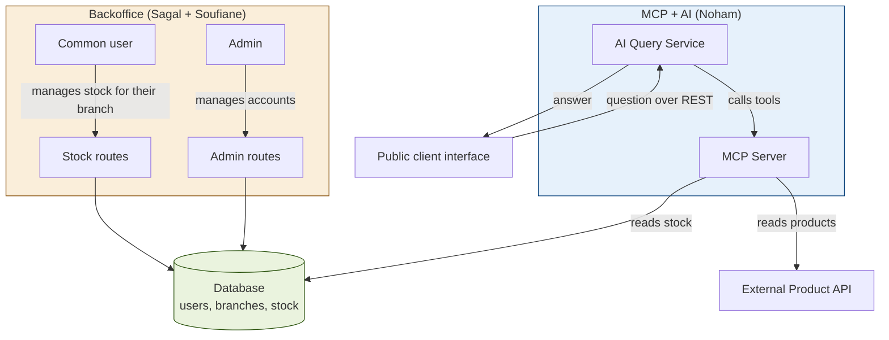
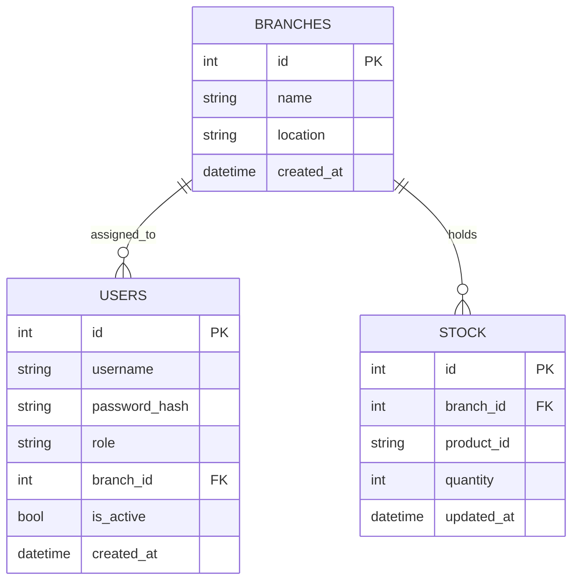

<div align="center">

# HBntory

**Multi-branch inventory management platform, with a public AI assistant**

Holberton School Project — Concepteur Développeur d'Applications


</div>

---

## Table of contents

- [Overview](#overview)
- [Team and task split](#team-and-task-split)
- [System architecture](#system-architecture)
- [Database schema](#database-schema)
- [Tech stack](#tech-stack)
- [Project structure](#project-structure)
- [Justified technical decisions](#justified-technical-decisions)
- [Installation and run](#installation-and-run)
- [Test accounts](#test-accounts)
- [Example questions for the assistant](#example-questions-for-the-assistant)
- [File-by-file explanation](#file-by-file-explanation)
- [Tests performed](#tests-performed)

---

## Overview

HBntory is a stock management system for a fictional retail company with multiple branches. The project combines two worlds that never talk to each other directly, and only ever share the same database:

- **Backoffice** — internal authenticated application, used to manage stock (employee side) and user accounts (admin side)
- **Client Web Interface** — public page, no authentication required, where anyone can ask a natural-language question about products and stock, answered by an AI agent connected to an MCP server

No product information (name, price, description) is ever stored locally: this data always comes from the external Product API provided by the school.

---

## Team and task split

Project built by a team of 3:

| Member | Focus area |
|---|---|
| **Sagal-Louise Haider** | Database, SQLAlchemy models, Product API integration |
| **Noham Oulma** | Product MCP Server, AI Query Service, AI agent |
| **Soufiane Filali** | Authentication, security, stock operations and admin management in the Backoffice |

### Detailed split (`backoffice/` folder)



---

## System architecture



**Key point**: the Backoffice and the AI side never communicate directly, they only share the same database. The Backoffice writes stock into it, the MCP Server reads it to answer public questions.

---

## Database schema



**Golden rule**: the `STOCK` table only stores the external product identifier (`product_id`), never its name, price, or description. That information is always fetched on demand from the Product API.

---

## Tech stack

| Component | Technology | Quick justification |
|---|---|---|
| Backoffice backend | Flask (REST API) | Lightweight, quick to set up as a team, matches the team's existing skills |
| ORM | SQLAlchemy | Required by the spec, natively protects against SQL injection |
| Database | SQLite | No server configuration needed, sufficient for the project's scope |
| Authentication | Flask-Login (sessions) | Classic internal use case, simpler to implement than JWT tokens in this context |
| Password hashing | bcrypt | Automatic salting, tunable cost factor, recognized standard for password storage |
| Public client communication | REST | Each question is handled independently, no conversation history to maintain |
| AI ↔ Product API bridge | MCP server (FastMCP) | Required by the spec, cleanly separates data access from the agent's logic |
| Backoffice interface | Vanilla HTML / CSS / JavaScript | No framework needed for the project's scope |
| Public client interface | Vanilla HTML / CSS / JavaScript | Simple chat page, no authentication |

---

## Project structure

```
project-root/
├── backoffice/
│   ├── app/
│   │   ├── __init__.py        # Flask factory, Flask-Login config
│   │   ├── models.py           # SQLAlchemy models (Branch, User, Stock)
│   │   ├── config.py            # Configuration (database, secret key, Product API)
│   │   ├── seed.py               # Initial data seeding script
│   │   └── product_api.py         # Client for the external Product API
│   ├── routes/
│   │   ├── __init__.py
│   │   ├── auth.py               # Login, logout, bcrypt hashing
│   │   ├── middleware.py          # Security decorators (role, branch)
│   │   ├── stock.py                # Stock operations (common user)
│   │   └── users.py                 # Account management (admin)
│   ├── requirements.txt
│   └── run.py                       # Server entry point
├── product_mcp_server/               # MCP server (Noham)
├── ai_service/                        # AI Query Service (Noham)
├── client_web/
│   └── index.html                     # Public interface (dashboard, chat, products, about)
├── admin/
│   ├── HBntory Admin.dc.html           # Backoffice interface (login, stock, users)
│   └── support.js                       # Runtime required to render the admin page
├── docs/                                # Documentation, diagrams
├── docker-compose.yml
├── Dockerfile.backoffice
└── README.md
```

---

## Justified technical decisions

### 1. Session-based authentication, not token-based

The Backoffice is a classic internal use case consumed by a single type of client (the browser). Flask-Login sessions avoid having to manually handle issuing, expiring, and verifying JWT tokens, saving meaningful time on a two-week project.

### 2. bcrypt for password hashing

- **How it works**: `bcrypt.hashpw()` generates a random salt on every hash and embeds it in the final result. `bcrypt.checkpw()` extracts that salt automatically to verify the supplied password.
- **Why not plain SHA256**: SHA256 is a general-purpose hash designed to be fast, which makes it vulnerable to large-scale brute-force attacks. bcrypt includes automatic salting (defeats rainbow tables) and a tunable cost factor that deliberately slows down every computation, making brute-force impractical.

### 3. Authorization enforced exclusively on the backend

Two reusable decorators (`role_required`, `branch_required`) protect every sensitive route. No permission check relies on the interface, a common user manually tampering with an HTTP request would still be blocked by the server.

### 4. REST rather than WebSocket for the public client

Each question sent to the chat is independent (no conversation history required by the spec), so a persistent connection brings no real benefit over the simplicity of a plain REST request.

### 5. Soft-delete rather than physical deletion

A deactivated user (`is_active = False`) can no longer log in, but their past stock movements remain intact in the database, matching the spec's requirement.

---

## Installation and run

```bash
# Backoffice
cd backoffice
python3 -m venv .venv
source .venv/bin/activate
pip install -r requirements.txt
python -m app.seed        # initializes the database (admin + branches + test stock)
python run.py               # starts the server at http://127.0.0.1:5000
```

The public client (`client_web/index.html`) and the admin interface (`admin/HBntory Admin.dc.html`) are served separately via a static server (for example Live Server in VS Code).

---

## Test accounts

| Username | Password | Role | Branch |
|---|---|---|---|
| `admin` | `ChangeMe123!` | Admin | — |
| `employee1` | `ChangeMe123!` | Common user | HBntory Paris |
| `employee2` | `ChangeMe123!` | Common user | HBntory Lyon |
| `employee3` | `ChangeMe123!` | Common user | HBntory Marseille |

---

## Example questions for the assistant

- *"Where can I find product X?"*
- *"What products are available in branch Y?"*
- *"I need 3 units of X, 2 of Y and 4 of Z, which branch(es) can I visit?"*
- *"Give me the details for product XX"*

---

## File-by-file explanation

### Backoffice — `app/`

| File | Role in one sentence |
|---|---|
| `models.py` | Defines the 3 tables (Branch, User, Stock) and the business rules enforced at the database level |
| `config.py` | Centralizes configuration (database path, secret key, Product API URL) |
| `seed.py` | Creates the admin, branches, and test stock on first run |
| `product_api.py` | HTTP client for the external Product API, with clean error handling (unavailability, product not found) |
| `__init__.py` | Assembles the Flask application: connects the database, configures Flask-Login, registers the routes |

### Backoffice — `routes/`

| File | Role in one sentence |
|---|---|
| `auth.py` | Login, logout, and the bcrypt hashing/verification functions |
| `middleware.py` | Two reusable security decorators: role check and branch check |
| `stock.py` | Add, remove, check, and list stock, restricted to the logged-in common user's branch |
| `users.py` | List, create, update, and deactivate accounts, restricted to the admin |

### `client_web/`

| File | Role in one sentence |
|---|---|
| `index.html` | Public interface: dashboard, AI assistant, product catalog, about page |

### `admin/`

| File | Role in one sentence |
|---|---|
| `HBntory Admin.dc.html` | Backoffice interface: login screen, stock management, account management |
| `support.js` | Runtime required to render the templating used by the admin page |

### Other

| File | Role in one sentence |
|---|---|
| `run.py` | Entry point that starts the Flask server |
| `docker-compose.yml` | Orchestration of the different services (Backoffice, Product API, MCP, AI Service) |
| `Dockerfile.backoffice` | Build instructions for the Backoffice image |

---

## Tests performed

**13 functional tests** covering authentication, roles, stock operations, and account management, all passed.

**7 security tests** covering SQL injection, role bypass via a stale session, mass assignment, type confusion, and unauthorized resource access — all passed, no exploitable flaw identified on the Backoffice side.

One point of attention was identified for Task 6 (Client Web Interface): data displayed on the client side should be escaped using `textContent` rather than `innerHTML`, to avoid any risk of stored XSS originating from data entered through the Backoffice.

**Manual integration tests (Sagal)**: 9 verifications run against the live backend and the external Product API, all passed.

1. Login with correct credentials
2. Login rejected with incorrect password
3. `GET /branches` returns the correct branch names
4. `DELETE /users/<id>` deactivates an account
5. `PATCH /users/<id>/reactivate` reactivates it
6. `PATCH /users/<id>` updates and persists a username change
7. `health_check()` against the real Product API
8. `get_product()` against the real Product API
9. `list_products()` against the real Product API

**AI Service / MCP Server tests (Noham)**: ~50 manual and automated checks run across the MCP tools and the AI agent's grounding behavior, still in progress, exact breakdown to be documented in `product_mcp_server/README.md` / `ai_service/README.md`.
