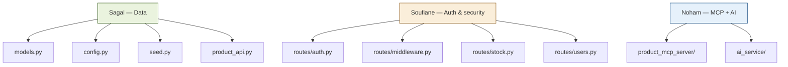
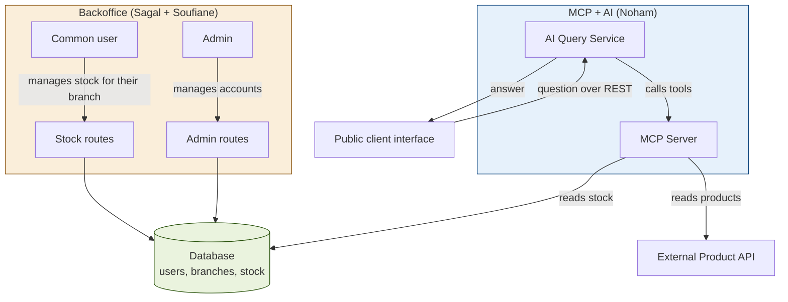
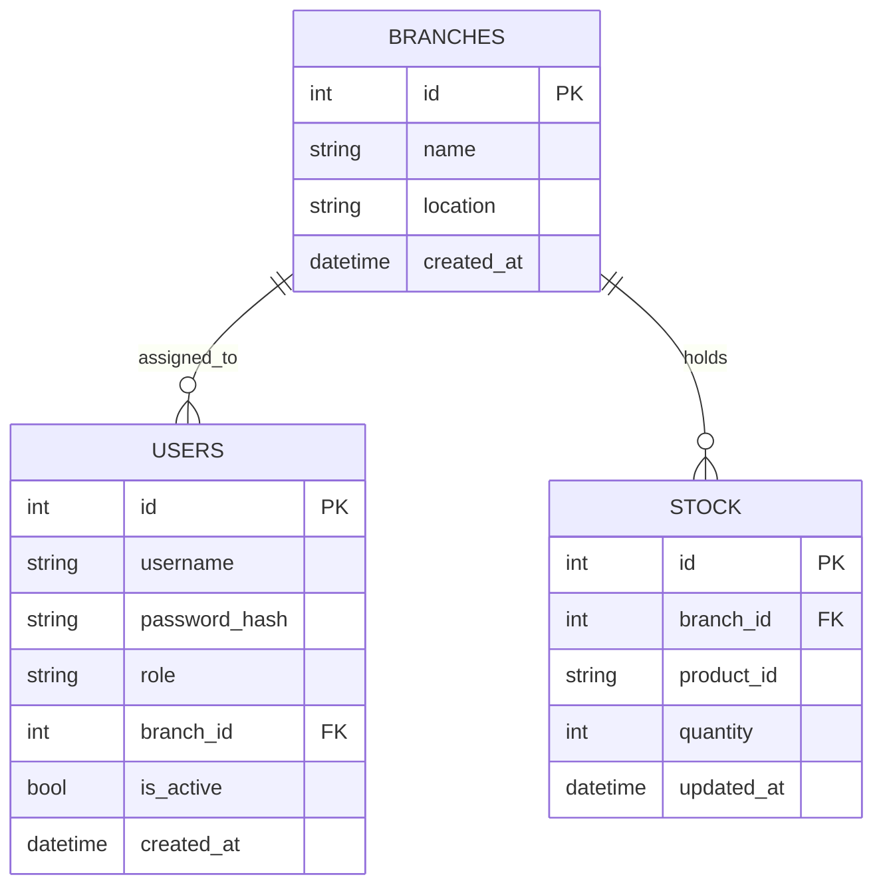

<div align="center">

# HBntory

**Multi-branch inventory management platform, with a public AI assistant**

Holberton School Project — Concepteur Développeur d'Applications


</div>

---

## Table of contents

- [Overview](#overview)
- [Team and task split](#team-and-task-split)
- [System architecture](#system-architecture)
- [Database schema](#database-schema)
- [Tech stack](#tech-stack)
- [Quick start](#quick-start)
- [Project structure](#project-structure)
- [Justified technical decisions](#justified-technical-decisions)
- [Tests performed](#tests-performed)
- [Known limitations](#known-limitations)
- [Documentation index](#documentation-index)

---

## Overview

HBntory is a stock management system for a fictional retail company with multiple branches. The project combines two worlds that never talk to each other directly, and only ever share the same database:

- **Backoffice** — internal authenticated application, used to manage stock (employee side) and user accounts (admin side)
- **Client Web Interface** — public page, no authentication required, where anyone can ask a natural-language question about products and stock, answered by an AI agent connected to an MCP server

No product information (name, price, description) is ever stored locally: this data always comes from the external Product API provided by the school.

---

## Team and task split

| Member | Focus area |
|---|---|
| **Sagal-Louise Haider** | Database schema and SQLAlchemy models, sessions and route protection, Product API integration, admin interface |
| **Noham Oulma** | Product MCP Server, AI Query Service, AI agent |
| **Soufiane Filali** | Password hashing, role and branch middleware, stock operations, admin user management |



---

## System architecture



**Key point**: the Backoffice and the AI side never communicate directly, they only share the same database. The Backoffice writes stock into it, the MCP Server reads it to answer public questions.

Components, data boundaries and twelve decision records: [`docs/architecture.md`](project-root/docs/architecture.md).

---

## Database schema



**Golden rule**: the `STOCK` table only stores the external product identifier (`product_id`), never its name, price, or description. That information is always fetched on demand from the Product API — there is no products table locally, so the rule cannot be broken by accident.

Constraints, validation rules and seeding: [`docs/database.md`](project-root/docs/database.md).

---

## Tech stack

| Component | Technology | Quick justification |
|---|---|---|
| Backoffice backend | Flask (REST API) | Lightweight, quick to set up as a team, matches the team's existing skills |
| ORM | SQLAlchemy | Required by the spec, natively protects against SQL injection |
| Database | SQLite | No server configuration needed, sufficient for the project's scope |
| Authentication | Flask-Login (sessions) | Single browser client, and allows immediate revocation |
| Password hashing | bcrypt | Automatic salting, tunable cost factor, standard for password storage |
| Public client communication | REST | Each question is independent, no conversation history to maintain |
| AI ↔ data bridge | MCP server (FastMCP) | Required by the spec, separates data access from the agent's logic |
| LLM provider | Groq | Free, OpenAI-compatible tool format, keeps the hand-written tool loop simple |
| Both frontends | Vanilla HTML / CSS / JavaScript | No framework needed for the project's scope |

---

## Quick start

The system runs as **five services, each in its own terminal**. Full step-by-step
instructions, including virtual environment setup, the Groq API key and a troubleshooting
section: **[`docs/quick-start-guide.md`](project-root/docs/quick-start-guide.md)**.

| # | Service | Port |
|---|---|---|
| 1 | Product API | 5001 |
| 2 | MCP Server | 8000 |
| 3 | AI Query Service | 8100 |
| 4 | Backoffice | 5000 |
| 5 | Static frontends | 5502 |

Then open:

- **Backoffice** (login required): http://127.0.0.1:5502/admin/
- **Public site** (no login): http://127.0.0.1:5502/client_web/

### Test accounts

| Username | Password | Role | Branch |
|---|---|---|---|
| `admin` | `ChangeMe123!` | Admin | — |
| `employee1` | `ChangeMe123!` | Common user | HBntory Paris |
| `employee2` | `ChangeMe123!` | Common user | HBntory Lyon |
| `employee3` | `ChangeMe123!` | Common user | HBntory Marseille |

Seeded stock is deliberately uneven across branches: some products are held everywhere at
different quantities, some are exclusive to a single branch, and several catalog products
are stocked nowhere — so the assistant has to answer "unavailable" rather than invent a
branch.

### Example questions for the assistant

- *"Where can I find HB-LAP-1001?"*
- *"What products are available in HBntory Lyon?"*
- *"I need 3 units of HB-LAP-1001, 2 of HB-MON-2101 and 4 of HB-KBD-4101, which branch can I visit?"*
- *"Give me the details for HB-MON-2102"*
- *"Tell me about HB-ZZZ-9999"* — unknown product: the assistant states the information is unavailable rather than inventing it

The agent answers in the language the question was asked in, French or English.

---

## Project structure

```
HBntory-Inventor-Management-Platform/
├── AUTHORS
├── README.md
├── requirements.txt
└── project-root/
    ├── backoffice/
    │   ├── app/
    │   │   ├── __init__.py         # Flask factory, Flask-Login config, CORS
    │   │   ├── models.py            # SQLAlchemy models (Branch, User, Stock)
    │   │   ├── config.py             # Database, secret key, Product API URL
    │   │   ├── seed.py                # Initial data seeding script
    │   │   └── product_api.py          # Client for the external Product API
    │   ├── routes/
    │   │   ├── auth.py                # Login, logout, bcrypt hashing
    │   │   ├── middleware.py           # Security decorators (role, branch)
    │   │   ├── stock.py                 # Stock operations (common user)
    │   │   └── users.py                  # Account management (admin)
    │   ├── requirements.txt
    │   └── run.py                        # Server entry point
    ├── product_mcp_server/                # MCP server (Noham)
    │   ├── server.py                       # Entry point
    │   ├── mcp_instance.py                  # FastMCP instance
    │   ├── product_api_client.py             # Calls the external Product API
    │   ├── db.py                              # Read-only access to the shared database
    │   └── tools/
    │       ├── products.py                     # list_products, search_products, get_product_details
    │       └── stock.py                         # check_stock, list_branch_stock, check_shopping_list
    ├── ai_service/                               # AI Query Service (Noham)
    │   ├── app.py                                 # REST endpoint for the client web
    │   ├── agent.py                                # Agent logic and tool-calling loop
    │   ├── tests/                                   # pytest suite (unit + live)
    │   └── .env.example                              # Template for the Groq API key
    ├── hbntory-products-api/                          # External Product API (provided)
    ├── client_web/
    │   ├── index.html                     # Dashboard, chat, catalog, about
    │   ├── support.js                      # Rendering runtime
    │   └── assets/                          # Product illustrations and team photos
    ├── admin/
    │   ├── index.html                      # Login, stock management, account management
    │   └── support.js                       # Rendering runtime
    └── docs/                                 # See documentation index below
```

---

## Justified technical decisions

Twelve decision records with benefits and trade-offs are documented in
[`docs/architecture.md`](project-root/docs/architecture.md). The four that shaped the system
most:

**Sessions rather than JWT.** The Backoffice has a single type of client, the browser, so a
token brings no benefit. Sessions allow immediate revocation: because the server holds the
state and reloads the user on every request, deactivating an account ends its session at
once. A JWT stays valid until it expires unless a denylist is maintained server-side.

**bcrypt for password hashing.** A random salt is generated per password and embedded in the
hash itself, and the cost factor is deliberately slow. A general-purpose hash like SHA256 is
designed to be fast, which is exactly the wrong property for password storage.

**Authorization enforced on the backend only.** Two decorators, `role_required` and
`branch_required`, protect every sensitive route. The branch always comes from the session,
never from the request. The interface hides forbidden actions for readability, never for
security — a hand-crafted request is still rejected with a 403.

**Product data resolved on demand, never stored.** Names are fetched from the Product API at
display time, in a single call per page. Reads and writes behave differently on purpose: if
the catalog is unavailable, the stock page degrades to raw SKUs and stays usable, while
adding stock returns a 503 rather than inserting a SKU that could not be verified.

---

## Tests performed

Every test is documented per team member, with the vulnerabilities found and the file fixed
for each, in [`docs/tests.md`](project-root/docs/tests.md).

| Area | Coverage | Method |
|---|---|---|
| Auth, roles, stock operations, admin management | Functional and security tests on the Backoffice | Manual, `curl` |
| Database, Product API integration, admin interface | Integration tests against the live backend and the real Product API | Manual, `curl` and browser |
| MCP tools | Tool-level tests, invalid identifiers, API outage handling | Manual script |
| AI agent and endpoint | Grounding behaviour, out-of-scope questions, tool selection | pytest, unit and live |

Three scenarios are demonstrated live during the presentation:

1. **Branch isolation** — a common user's hand-crafted request against another branch is rejected with a 403 by the route, bypassing the interface entirely.
2. **Immediate session invalidation** — an account deactivated while its session is active loses access on its next request, not at next login.
3. **Graceful degradation** — with the Product API stopped, the stock page still loads and falls back to raw SKUs.

---

## Known limitations

- **Uneven automated test coverage.** The AI Service has a pytest suite; the Backoffice is verified manually through documented `curl` commands. A pytest suite covering the authorization decorators would be the first addition, since those rules are the most security-sensitive part of the codebase.
- **XSS escaping on the client side.** Values entered through the Backoffice are stored as raw text by the API, which is expected at that layer; the Client Web Interface must render them with `textContent` rather than `innerHTML`.
- **No containerization.** Docker was dropped in favour of a documented manual startup, so reproducing the environment relies on following the guide rather than on a single command.
- **`GET /branches` is admin-only.** Common users would need it to display their own branch name; the admin interface works around this with a hardcoded list.
- **The MCP server is coupled to the Backoffice schema.** It imports the SQLAlchemy models directly, so a model change on the Backoffice side can break the stock tools.
- **`db.create_all()` does not migrate.** It creates missing tables but never alters existing ones, so a database created before a constraint was added will not gain it. Alembic would be the production answer.
- **SQLite serializes writes.** Sufficient for this scope. `SQLALCHEMY_DATABASE_URI` is environment-overridable, so moving to PostgreSQL requires no code change.
- **No SSL/TLS**, explicitly out of scope per the project brief.

---

## Documentation index

| Document | Contents |
|---|---|
| [`docs/quick-start-guide.md`](project-root/docs/quick-start-guide.md) | Step-by-step installation and startup, with troubleshooting |
| [`docs/architecture.md`](project-root/docs/architecture.md) | Components, data boundaries, twelve decision records, MVP |
| [`docs/database.md`](project-root/docs/database.md) | Schema, constraints, seeding, validation rules |
| [`docs/authentication.md`](project-root/docs/authentication.md) | Authentication and authorization strategy |
| [`docs/ui-backend-approach.md`](project-root/docs/ui-backend-approach.md) | REST vs SSR decision, frontend stack, CORS |
| [`docs/product_mcp_server.md`](project-root/docs/product_mcp_server.md) | MCP server tools and error handling |
| [`docs/ai_service.md`](project-root/docs/ai_service.md) | AI Query Service, agent, supported question types |
| [`docs/tests.md`](project-root/docs/tests.md) | Tests and fixed vulnerabilities, per member |