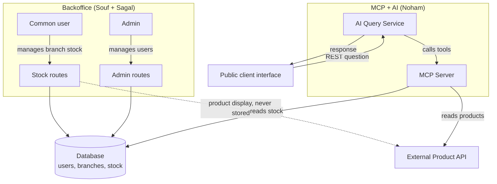

# HBntory — Architecture

Team project: Souf, Noham, Sagal

**Roles**: Souf: password hashing, role and branch middleware, stock operations, admin user management · Sagal: database schema and SQLAlchemy models, sessions and route protection, Product API integration, admin interface · Noham: MCP Server & AI Query Service

## 1. Service diagram

## 2. Components and responsibilities

| Component | Responsibility | DB access | Product API access |
|---|---|---|---|
| **Backoffice** | Authenticated web app. Admin manages users, common user manages stock for their branch. | Read/write (users, stock) | Read, on the fly (display only, never persisted) |
| **Database** | Single schema shared between the Backoffice and the AI Service: `users`, `branches`, `stock`. Stores **no** product data, only the `product_id`. | - | - |
| **Product API** | Provided by the school, read-only. Plain Python (`http.server`), no Docker required, run with `python3 app.py`. Single source of truth for product name, description, price, and image. | - | - |
| **MCP Server** | Bridge between the AI Service and the data sources. Exposes tools to list/detail products (via the Product API) and to query stock (read-only on the DB). | Read-only (stock) | Read |
| **AI Service** | Independent from the Backoffice. One or more agents process natural-language questions from the Client Web via the MCP Server tools. Never invents an answer, clearly states when information is unavailable. | Read-only (stock, via MCP) | Read (via MCP) |
| **Client Web** | Public, anonymous page, chat or search-box style. Each question is handled independently (no history stored). | - | - |

## 3. Data separation rules

- **Golden rule**: the local database never stores product data (name, description, price, image, metadata). Only the `product_id` is stored, as a key into the external Product API.
- The Backoffice may **call** the Product API for display purposes (e.g. resolving product names on the stock page), but this data is never **persisted** in the database - the distinction is between a transient call and actual storage.
- **Single database**, shared between the Backoffice and the AI Service. No duplication of the data model between the two services.
- The AI Service has **read-only** access to stock. Only a common user, through the Backoffice, can modify quantities (add/remove), and only for their assigned branch.

## 4. Roles and permissions (Backoffice)

**Admin (single account)**
- List, create, modify common users
- Assign / change a user's branch
- Change a user's password
- Soft-delete a user (never a hard delete), and reactivate a soft-deleted account
- **Never** manages stock
- Cannot modify or deactivate its own account: there is no endpoint to create another admin, so this would lock the system out irreversibly. Enforced on the backend, not only hidden in the UI.

**Common user (assigned to one branch)**
- Add stock (their branch only)
- Remove stock (their branch only)
- Consult stock (their branch only)
- List products currently in stock for their branch
- **Never** manages users, nor stock for another branch

Authorization is enforced **on the backend**, never only in the UI. Two decorators carry it:
`role_required` checks authentication then role, `branch_required` compares the branch in the
session against the branch targeted by the request. The branch always comes from the session,
never from the request body or URL.

Account status is re-checked on **every** request through Flask-Login's `user_loader`, so a
soft-deleted user loses access immediately rather than at their next login attempt.

## 5. Stock model

- Minimum fields: `branch_id`, `product_id`, `quantity`
- Invariant: `quantity >= 0` (enforced at the DB level, in addition to application-level validation)
- Uniqueness: one stock row per `(branch_id, product_id)` pair, so adding stock updates the existing row instead of creating a duplicate
- Every add/remove operation validates the requested quantity before applying it
- `product_id` is a plain string, not a foreign key: the catalog lives in another system, so the database cannot constrain it. Existence is validated at the application level, on write operations only.

## 6. Decision records

### Decision 1  Client Web ↔ AI Service communication
- **Choice**: REST
- **Benefit**: each client question is independent, no conversation history to maintain — REST is the simplest option and sufficient for the requirement.
- **Trade-off**: no response streaming or real-time chat experience (which WebSocket would enable, but it's not a project requirement).

### Decision 2  Stock access for the AI agent (extending MCP vs third-party MCP vs internal API)
- **Choice**: extend our own MCP server with read-only stock tools, rather than a third-party MCP Toolbox for Databases, or a controlled internal API exposed by the Backoffice.
- **Benefit**: a single MCP server to maintain and fully understand, existing hands-on experience with FastMCP, and a single place to observe/debug every tool call the agent makes (products and stock alike).
- **Trade-off**: we have to guarantee ourselves that the exposed stock tools stay read-only (no built-in safeguard from a specialized third-party tool). The MCP server is also coupled to the Backoffice's DB schema, so a model change on the data side can break it.
- **Why not a third-party MCP Toolbox for Databases**: gives the agent flexible SQL-like access, which is harder to keep read-only and scoped, and weakens "clear boundaries" versus a small set of hand-written, single-purpose tools.
- **Why not a controlled internal API in the Backoffice**: would require the AI Service to call the Backoffice directly, which breaks Decision 3 (Backoffice and AI Service are independent services that only share the database, never call each other) and adds an extra network hop/latency for no real benefit here.

### Decision 3  Backoffice / AI Service separation
- **Choice**: two independent services sharing the same database.
- **Benefit**: meets the project requirement, and avoids the mistake of duplicating the data model across two separate databases.
- **Trade-off**: requires clear discipline about who writes what in the shared DB (see section 3).

### Decision 4  Backoffice: SSR vs REST + separate JS frontend
- **Choice**: REST API (team decision — supersedes an earlier solo leaning toward SSR/Jinja2)
- **Benefit**: consistent communication style across the whole system (Backoffice, AI Service, and Client Web all expose/consume REST), and decouples the Backoffice backend from any specific frontend implementation. It also keeps every authorization rule on the routes, instead of splitting it between routes and templates.
- **Trade-off**: requires a separate frontend layer to consume the API rather than server-rendered templates — more moving parts to wire together for a solo/small-team timeline, but the team judged it worth the consistency. Loading and error states also have to be handled by hand.

### Decision 5  Password hashing mechanism
- **Choice**: bcrypt
- **Benefit**: built-in salting, resistant to brute-force, industry standard for password storage.
- **Trade-off**: slightly slower than hashes not designed for passwords (plain SHA), which is actually the intended behavior here.

### Decision 6  Session-based authentication, not tokens
- **Choice**: server-side sessions through Flask-Login, rather than JWT.
- **Benefit**: the Backoffice has a single type of client (the browser), so a token brings no benefit. Sessions allow **immediate revocation**: because the server holds the state and reloads the user on every request, deactivating an account ends its session at once.
- **Trade-off**: state on the server, which does not scale horizontally without a shared session store. Out of scope here, and the revocation guarantee was worth more than the statelessness.
- **Why not JWT**: a token stays valid until it expires. Revoking one requires maintaining a denylist server-side, which reintroduces exactly the state a JWT was meant to avoid.

### Decision 7  Product data resolution in the Backoffice
- **Choice**: resolve product names on demand from the Product API, in a single call per page, and never persist them. Behave asymmetrically between reads and writes.
- **Benefit**: the golden rule is respected structurally. On a **read**, if the catalog is unavailable the stock page degrades to raw SKUs and stays usable. On a **write**, adding stock requires validating the SKU against the catalog, so an unreachable API returns a clear 503 rather than inserting an identifier we could not verify.
- **Trade-off**: product names cannot be displayed at all when the catalog is down, and stock cannot be added during an outage. Both are deliberate: the alternative would be caching product data locally, which the spec forbids.

### Decision 8  AI agent integration style (direct SDK vs orchestration framework)
- **Choice**: call the LLM provider's API directly and write the tool-calling loop by hand, instead of using an orchestration library (LangChain, LlamaIndex).
- **Benefit**: the tool-calling loop (send tools, get a tool call back, run it, send the result back) stays fully visible in our own code, which makes it easy to observe and debug which tool calls the agent makes, a project requirement. It also avoids pulling in a large dependency and its own abstractions for a need that stays simple: one agent, one MCP server, no multi-turn memory.
- **Trade-off**: we have to write the loop ourselves (a few dozen lines), and we would not get the orchestration framework's built-in features (multi-agent, memory, RAG) for free if the project grew.

### Decision 9  LLM provider
- **Choice**: Groq, not the Anthropic API or Google Gemini.
- **Benefit**: free to use, no payment method required, and its API follows the same message/tool format as OpenAI, which is the most common and best documented format, and is close to the general tool-use pattern used everywhere else in this project. This makes Decision 8 (hand-written tool loop) simple to implement.
- **Trade-off**: the models available on Groq are open-source models, not Claude, so they may be somewhat less reliable at deciding when and how to call a tool than a frontier model. Mitigated by keeping the tool set small (5 tools) and well-described.

### Decision 10  Supported question scope enforcement
- **Choice**: enforce the "only answer these 4 question types" rule through the agent's system prompt, in the same LLM call that answers the question, instead of a separate classification step beforehand.
- **Benefit**: one LLM call instead of two, simpler code, matches the two-week project scope.
- **Trade-off**: less predictable than a dedicated classifier on ambiguous edge-case questions, since the same call both judges scope and answers.

### Decision 11  Response language
- **Choice**: no fixed response language. The agent answers in whichever language the question was asked in (French or English).
- **Benefit**: no extra configuration needed, this is native behavior for the LLM, and it fits a public client with an unknown audience.
- **Trade-off**: none identified for this project's scope.

### Decision 12  No containerization
- **Choice**: run the five services as plain Python processes, one terminal each. Docker was evaluated, partially implemented, then dropped.
- **Benefit**: a transparent setup with no build step, no image to rebuild after a code change, and no shared-volume reasoning between containers for the SQLite file. Removes a category of failure during a live demo.
- **Trade-off**: reproducing the environment relies on the reader following the README rather than on a single command, and the startup is longer.

## 7. MVP

The MVP targets one working end-to-end path first, proving the full system integration before adding breadth.

### Must-have (core MVP)
- **Database**: `users`, `branches`, `stock` models, with `quantity >= 0` enforced at the DB level.
- **Auth**: bcrypt password hashing, login for admin and common users, role enforced on the backend.
- **Backoffice (REST API)**:
  - Admin: list/create/modify common users, assign branch, soft-delete, change password.
  - Common user: add/remove/consult stock, scoped to their assigned branch.
- **Product API integration**: basic read-only calls from the Backoffice and from the MCP server (no product data ever persisted locally).
- **MCP Server**: `list_products`, `get_product_details`, and one read-only stock tool.
- **AI Service**: a single agent able to reliably answer one question type, *"Which branch has stock of product X?"* — using the MCP tools, with a clear "I don't have that information" fallback when data is missing.
- **Client Web**: a simple REST-based page, anonymous, no history, that can ask that one question type and get a correct answer.

### Later (after the MVP path works end-to-end)
- Support for the remaining example question types: *"What products can I find in branch Y?"*, multi-product/multi-branch aggregation ("3 X, 2 Y, 4 Z - which branch?"), and product detail lookups.
- Dropdown-style product pickers in the Backoffice populated live from the Product API.

### Optional (only if time allows)
- Any UI polish beyond functional.
- Broader automated test coverage beyond the core flows.
- WebSocket-based client communication (already ruled out, see Decision 1, but kept here as a reminder not to revisit it under time pressure).

### Status at delivery
The core MVP is complete. The MCP server ships **five** stock and product tools rather than
the three planned, so all four example question types are supported, including the
multi-product shopping-list case. Product names are resolved in the Backoffice stock view;
the live-populated product picker was not implemented, the `/products` route that would feed
it exists but is not wired to the interface.