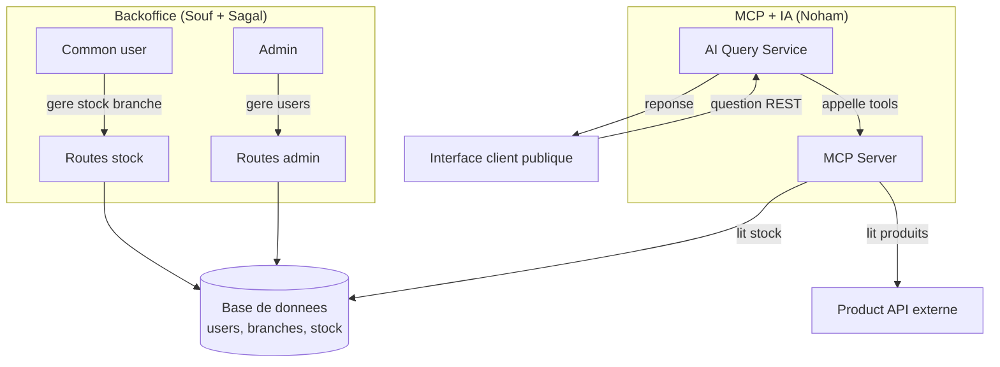

# HBntory — Architecture

Team project — Sagal-Louise Haider, Souf, Noham

**Roles**: Souf — auth & Backoffice security · Sagal — Backoffice data (DB, config, seed, Product API integration) · Noham — MCP Server & AI Query Service

## 1. Service diagram

> Note: this diagram doesn't show the Backoffice → Product API link. Per the golden rule (section 3), the Backoffice does call the Product API on the fly for display purposes (e.g. populating a product picker) without ever persisting that data. Worth adding once the team agrees on how to represent it.

## 2. Components and responsibilities

| Component | Responsibility | DB access | Product API access |
|---|---|---|---|
| **Backoffice** | Authenticated web app. Admin manages users, common user manages stock for their branch. | Read/write (users, stock) | Read, on the fly (display only, never persisted) |
| **Database** | Single schema shared between the Backoffice and the AI Service: `users`, `branches`, `stock`. Stores **no** product data — only the `product_id`. | — | — |
| **Product API** | Provided as a Docker container, read-only. Single source of truth for product name, description, price, and image. | — | — |
| **MCP Server** | Bridge between the AI Service and the data sources. Exposes tools to list/detail products (via the Product API) and to query stock (read-only on the DB). | Read-only (stock) | Read |
| **AI Service** | Independent from the Backoffice. One or more agents process natural-language questions from the Client Web via the MCP Server tools. Never invents an answer — clearly states when information is unavailable. | Read-only (stock, via MCP) | Read (via MCP) |
| **Client Web** | Public, anonymous page, chat or search-box style. Each question is handled independently (no history stored). | — | — |

## 3. Data separation rules

- **Golden rule**: the local database never stores product data (name, description, price, image, metadata). Only the `product_id` is stored, as a key into the external Product API.
- The Backoffice may **call** the Product API for display purposes (e.g. a dropdown when adding stock), but this data is never **persisted** in the database — the distinction is between a transient call and actual storage.
- **Single database**, shared between the Backoffice and the AI Service. No duplication of the data model between the two services.
- The AI Service has **read-only** access to stock. Only a common user, through the Backoffice, can modify quantities (add/remove), and only for their assigned branch.

## 4. Roles and permissions (Backoffice)

**Admin (single account)**
- List, create, modify common users
- Assign / change a user's branch
- Change a user's password
- Soft-delete a user (never a hard delete)
- **Never** manages stock

**Common user (assigned to one branch)**
- Add stock (their branch only)
- Remove stock (their branch only)
- Consult stock (their branch only)
- List products currently in stock for their branch
- **Never** manages users, nor stock for another branch

Authorization is enforced **on the backend**, never only in the UI.

## 5. Stock model

- Minimum fields: `branch_id`, `product_id`, `quantity`
- Invariant: `quantity >= 0` (enforced at the DB level, in addition to application-level validation)
- Every add/remove operation validates the requested quantity before applying it

## 6. Decision records

### Decision 1 — Client Web ↔ AI Service communication
- **Choice**: REST
- **Benefit**: each client question is independent, no conversation history to maintain — REST is the simplest option and sufficient for the requirement.
- **Trade-off**: no response streaming or real-time chat experience (which WebSocket would enable, but it's not a project requirement).

### Decision 2 — Stock access for the AI agent (extending MCP vs third-party MCP)
- **Choice**: extend my own MCP server with read-only stock tools, rather than a third-party MCP Toolbox for Databases.
- **Benefit**: a single MCP server to maintain and fully understand, and existing hands-on experience with FastMCP.
- **Trade-off**: I have to guarantee myself that the exposed stock tools stay read-only (no built-in safeguard from a specialized third-party tool).

### Decision 3 — Backoffice / AI Service separation
- **Choice**: two independent services sharing the same database.
- **Benefit**: meets the project requirement, and avoids the mistake (flagged by my SWE) of duplicating the data model across two separate databases.
- **Trade-off**: requires clear discipline about who writes what in the shared DB (see section 3).

### Decision 4 — Backoffice: SSR vs REST + separate JS frontend
- **Choice**: REST API (team decision — supersedes an earlier solo leaning toward SSR/Jinja2)
- **Benefit**: consistent communication style across the whole system (Backoffice, AI Service, and Client Web all expose/consume REST), and decouples the Backoffice backend from any specific frontend implementation.
- **Trade-off**: requires a separate frontend layer to consume the API rather than server-rendered templates — more moving parts to wire together for a solo/small-team timeline, but the team judged it worth the consistency.

### Decision 5 — Password hashing mechanism
- **Choice**: bcrypt
- **Benefit**: built-in salting, resistant to brute-force, industry standard for password storage.
- **Trade-off**: slightly slower than hashes not designed for passwords (plain SHA) — which is actually the intended behavior here.

## 7. MVP

The MVP targets one working end-to-end path first, proving the full system integration before adding breadth.

### Must-have (core MVP)
- **Database**: `users`, `branches`, `stock` models, with `quantity >= 0` enforced at the DB level.
- **Auth**: bcrypt password hashing, login for admin and common users, role enforced on the backend.
- **Backoffice (SSR)**:
  - Admin: list/create/modify common users, assign branch, soft-delete, change password.
  - Common user: add/remove/consult stock, scoped to their assigned branch.
- **Product API integration**: basic read-only calls from the Backoffice and from the MCP server (no product data ever persisted locally).
- **MCP Server**: `list_products`, `get_product_details`, and one read-only stock tool.
- **AI Service**: a single agent able to reliably answer one question type — *"Which branch has stock of product X?"* — using the MCP tools, with a clear "I don't have that information" fallback when data is missing.
- **Client Web**: a simple REST-based page, anonymous, no history, that can ask that one question type and get a correct answer.

### Later (after the MVP path works end-to-end)
- Support for the remaining example question types: *"What products can I find in branch Y?"*, multi-product/multi-branch aggregation ("3 X, 2 Y, 4 Z — which branch?"), and product detail lookups.
- Dropdown-style product pickers in the Backoffice populated live from the Product API.

### Optional (only if time allows)
- Any UI polish beyond functional.
- Broader automated test coverage beyond the core flows.
- WebSocket-based client communication (already ruled out — see Decision 1 — but kept here as a reminder not to revisit it under time pressure).