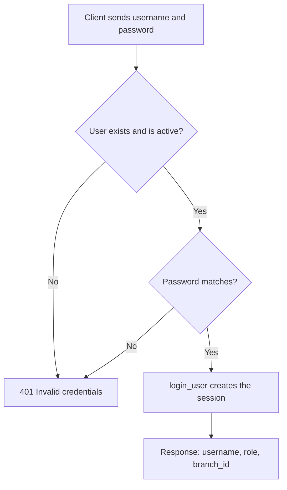
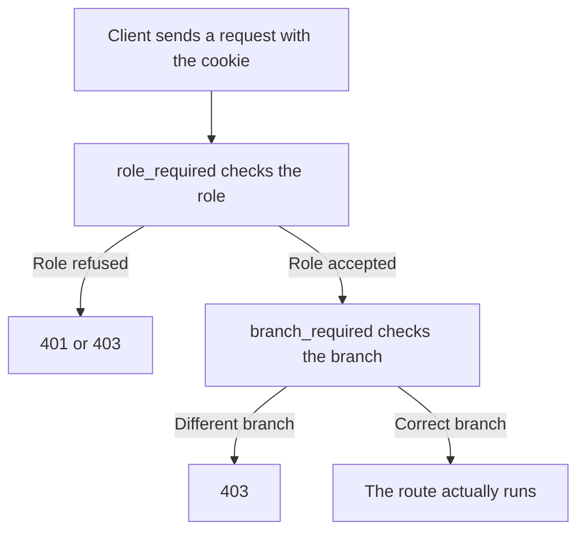

# HBntory: Authentication and Authorization

This document explains how login and access rights work in the HBntory Backoffice. It is written for someone discovering the project for the first time.

## 1. Two words to know before anything else

**Authentication**: proving who you are. This is the login step, with a username and a password.

**Authorization**: once the system knows who you are, deciding what you're allowed to do. An admin and an employee (common user) don't have the same rights.

The HBntory Backoffice uses **session based** authentication, with passwords protected by **bcrypt** (a hashing method, explained further down). There is no "token" like a JWT, and no API key. After logging in, the browser receives a digitally signed session cookie, sent automatically with every request that follows.

Authorization is checked at two levels, always **on the server side**:
1. The account's role (`Role`): admin or employee
2. For an employee, the branch their account is tied to (`branch_id`)

An important point: no permission check is ever done on the browser side (frontend). Hiding a button in the interface doesn't protect anything. A determined user could always call the API directly, without going through the buttons. This is why the check must always happen server side, never only in the display.

## 2. The data model

Defined in `backoffice/app/models.py`.

```python
class Role(enum.Enum):
    ADMIN = "admin"
    COMMON_USER = "common_user"
```

The `users` table contains:
- `username`: unique identifier
- `password_hash`: the password, never stored in plain text, always hashed with bcrypt
- `role`: `ADMIN` or `COMMON_USER`
- `branch_id`: the branch tied to the account, can be empty (nullable)
- `is_active`: a boolean (true or false) used to deactivate an account without deleting it

A consistency rule is enforced directly at the database level:

```python
CheckConstraint(
    "(role = 'ADMIN' AND branch_id IS NULL) OR "
    "(role = 'COMMON_USER' AND branch_id IS NOT NULL)",
)
```

In plain terms: an admin never has a branch. An employee always has exactly one branch. This rule is checked as soon as the database is created, not only in the application code. Even if a bug in the code forgot to check this rule, the database would still refuse an inconsistent value.

`User` inherits from `UserMixin` (provided by Flask Login), which automatically gives useful methods (`get_id()`, `is_authenticated`, `is_active`, `is_anonymous`) without having to rewrite them.

## 3. Password hashing

**Hashing** means turning a password into an unreadable string of characters that cannot be reversed. You can never get the original password back from the hash, you can only check that a given password matches the stored hash.

In `backoffice/routes/auth.py`:

```python
def hash_password(password: str) -> str:
    return bcrypt.hashpw(password.encode(), bcrypt.gensalt()).decode()

def verify_password(password: str, password_hash: str) -> bool:
    return bcrypt.checkpw(password.encode(), password_hash.encode())
```

`bcrypt.gensalt()` adds a random "salt" to every hash. This is a unique value mixed into the password before hashing it. As a result, two accounts sharing the same password never end up with the same stored hash. This protects against certain attacks that rely on precomputed tables of known hashes.

## 4. Login (`POST /login`)

Here is what happens step by step when someone logs in:



1. The server looks up the user by their `username`
2. It rejects the request if the user doesn't exist, if the password is incorrect, or if the account is disabled (`is_active = False`)
3. In every one of these rejection cases, the same generic message `"Invalid credentials"` is returned (with status code 401), so as not to give any hint about what was wrong (the username or the password)
4. If everything is correct, `login_user(user)` creates the session on the Flask Login side
5. The response returns three useful pieces of information: `username`, `role`, and `branch_id`. This lets the frontend know right away which page to route the person to (the user list for an admin, the stock view for an employee), without needing a second request to find out

## 5. Logout (`POST /logout`)

Protected by `@login_required` (you need to already be logged in to be able to log out). It calls `logout_user()`, which removes the session on the server side.

## 6. Role based authorization: `role_required`

A "decorator" in Python is a function that wraps another one to add behavior before or after it runs, without changing its internal code. That's exactly what `role_required` does: it runs before every route to check permissions, before the route's own code even starts.

Defined in `backoffice/routes/middleware.py`:

```python
def role_required(*roles):
    def decorator(f):
        @wraps(f)
        def wrapper(*args, **kwargs):
            if not current_user.is_authenticated:
                return jsonify({"status": "error", "message": "Unauthorized"}), 401
            if current_user.role not in roles:
                return jsonify({"status": "error", "message": "Access denied"}), 403
            return f(*args, **kwargs)
        return wrapper
    return decorator
```

Used on every sensitive route, for example:

```python
@role_required(Role.ADMIN)
def list_users(): ...

@role_required(Role.COMMON_USER)
def add_stock(branch_id): ...
```

Two clearly distinct failure cases:
- No valid session: error 401 (Unauthorized, not logged in)
- Valid session but wrong role: error 403 (Access denied, logged in but not allowed)

## 7. Branch based authorization: `branch_required`

Also in `middleware.py`, this decorator is added on top of `role_required` on the stock management routes:

```python
def branch_required(f):
    @wraps(f)
    def wrapper(*args, **kwargs):
        branch_id = kwargs.get("branch_id")
        if current_user.branch_id != branch_id:
            return jsonify({"status": "error", "message": "Access denied"}), 403
        return f(*args, **kwargs)
    return wrapper
```

It compares the `branch_id` present in the web address (the URL, for example `/branches/2/stock`) with the branch of the connected account. An employee can never act on another branch's stock, even by manually editing the URL in the browser.

## 8. How a protected request is handled

Here is the full path of a request, from the browser all the way to the route that does the actual work:



The two checks happen one after the other. If the first one fails, the second one is never reached, and the route's own code (the business logic) never runs.

## 9. Who is allowed to do what

| Route | Method | Role required | Branch check |
|---|---|---|---|
| `/login` | POST | none | no |
| `/logout` | POST | logged in | no |
| `/users` | GET, POST | ADMIN | no |
| `/users/id` | PATCH, DELETE | ADMIN | no |
| `/users/id/reactivate` | PATCH | ADMIN | no |
| `/branches/id/stock` | GET, POST | COMMON_USER | yes, own branch only |
| `/branches/id/stock/remove` | POST | COMMON_USER | yes, own branch only |
| `/branches/id/stock/product_id` | GET | COMMON_USER | yes, own branch only |
| `/products` | GET | COMMON_USER | no |
| `/stock` | GET | ADMIN | no, global read only view |

An admin has no access to any route that changes stock. An employee has no access to any user management route. This is not just a convention followed by the frontend: every route explicitly refuses the request if the role doesn't match, no matter how the request was sent.

## 10. Deleting an account: only a deactivation

`DELETE /users/id` never actually removes the row from the database. It only changes `is_active` to `False`:

```python
user.is_active = False
db.session.commit()
```

This is called a "soft delete", as opposed to a physical deletion that would erase the data for good. A deactivated account can no longer log in, but its history (for example its past stock operations) stays intact in the database. The route `PATCH /users/id/reactivate` reverses this deactivation.

## 11. What this system does not cover

To be honest about the current limits:

- No limit on the number of login attempts (no protection against repeated tries on `/login`). This is out of scope for this project.
- No automatic session expiration beyond Flask Login's default behavior.
- The `SECRET_KEY` (used to sign session cookies) has a development value written directly in `app/config.py`. In a real production environment, it should be set through an environment variable.

## 12. The boundary with the public site

The public site (`client_web/`) has **no authentication** at all and never calls Backoffice routes. It only queries the external product API (read only) and the AI agent. That agent itself only has read access to stock, never write access, through the MCP server's tools. No session, no cookie, no role ever exists on the public site side.